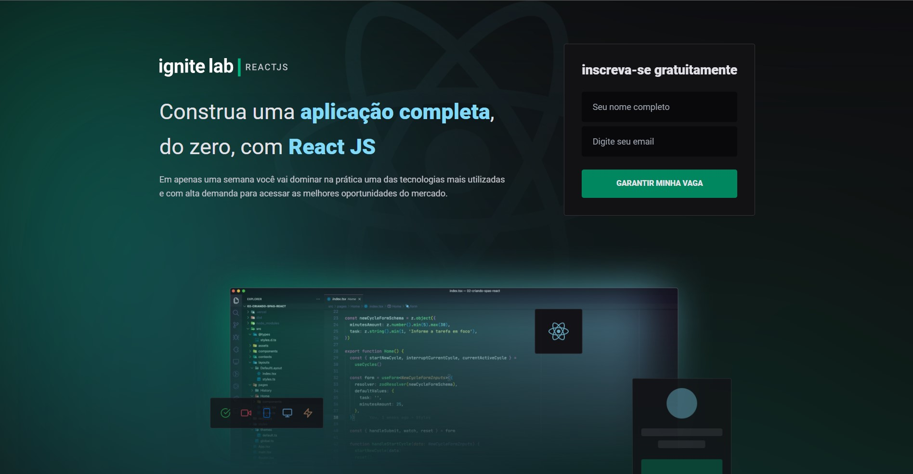
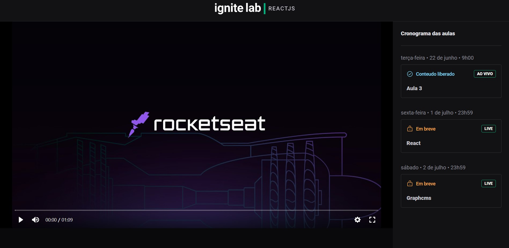

# Rocketseat - challenge
ignite-lab - WebPage with React-Ts and GraphQL

## Tecnologias / _technologies_
- [React](https://pt-br.reactjs.org/)
- [TypeScript](https://www.typescriptlang.org/)
- [Vite](https://vitejs.dev/)
- [Graphcms](https://graphcms.com/)
- [Apollo Client](https://www.apollographql.com/)
- [GraphQL](https://graphql.org/)
- [Vime](https://vimejs.com/)
- [Tailwind](https://tailwindcss.com/)
- [Phosphor Icons](https://phosphoricons.com/)
- [Graphql Generate Code](https://www.graphql-code-generator.com/)

# Project view


<br/>
<br/>


## Iniciando ##

##### starting like below, you can check the code working in localhost:
```
git clone git@github.com:ogoiddev/rocketseat.git
```
```
npm install
```
```
npm run dev
```


### Feito muito muito carinho / Lot of passion here - @ogoiddev
